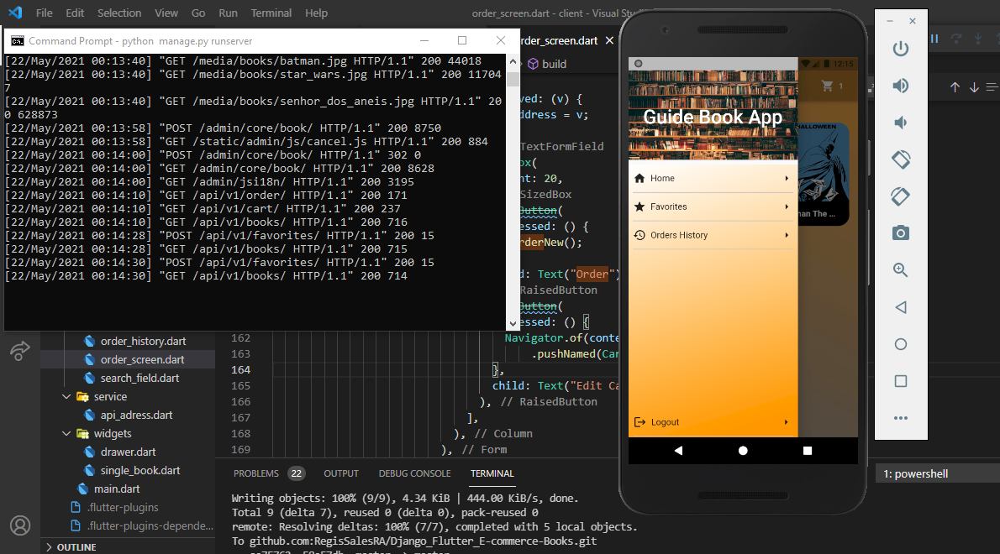

# Django Flutter E-commerce Books

Follow Steps:

# Python

First Step:
    
    python3 -m venv venv
    sourve venv/bin/activate
    pip3 install -r requirements-dev.txt
        
Second Step:

    Now, just rename the .env.sample file to .env and run:
    

Third Step:

    python3 manage.py migrate

Fourth Step:

    python3 manage.py createsuperuser
    
Finally

    run a command: python3 manage.py runserver

# Flutter

# OBS 

    lib/service/api_adress.dart (const String baseUrl = "http://10.0.2.2";) you must change your IP if you trying to run this project with real mobile

First Step:

    flutter packages get
        
Second Step:

    flutter run

#  E-commerce Book Overview

# Login

# Home

# Layout drawer

# Favorite

